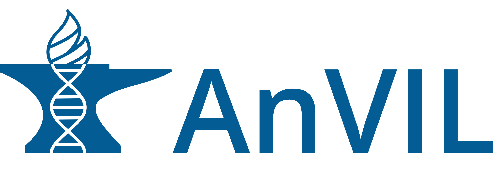

  <h2>
    <a href="https://github.com/NCPITest">Home</a> |
    <a href="https://github.com/NCPITest/About/blob/main/README.md">About</a> |
    <a> Partners</a> |
    <a href="https://github.com/NCPITest/Projects/blob/main/README.md">Projects</a> |
    <a href="https://github.com/NCPITest/Resources/blob/main/README.md">Resources</a>
  </h2>

## 
  Partner Systems  

---

<h3> NHGRI AnVIL </h3>

NHGRI's Genomic Data Science Analysis, Visualization, and Informatics Lab-Space 

[Visit Website](https://anvilproject.org) 

[Learn More](https://www.genome.gov/Funded-Programs-Projects/Computational-Genomics-and-Data-Science-Program/Genomic-Analysis-Visualization-Informatics-Lab-space-AnVIL)

**Social**  
- [@useAnVIL (Twitter)](https://twitter.com/useAnVIL)  
- [YouTube Channel](https://www.youtube.com/channel/UCBbHCj7kUogAMFyBAzzzfUw)

---

<h3> NHLBI BioData Catalyst (BDC) </h3>

Tools, applications, and workflows in secure workspaces  
[Visit Website](https://biodatacatalyst.nhlbi.nih.gov)

**Social**  
- [#BioDataCatalyst (Twitter)](https://twitter.com/hashtag/BioDataCatalyst)  
- [YouTube Channel](https://www.youtube.com/channel/UCGkmY5oNK8uFZzT8vV_9KgQ)

---

<h3> NCI Cancer Research Data Commons (CRDC) </h3>

Accelerating data-driven scientific discovery  
[Visit Website](https://datacommons.cancer.gov/)

**Social**  
- [#NCICommons (Twitter)](https://twitter.com/hashtag/NCICommons)  
- [YouTube Video](https://www.youtube.com/embed/tk1nEX2gnqk)

---

<h3> NIH Common Fund - Kids First Data Resource Center (KFDRC) </h3>

United with Researchers to Drive Data-Driven Discoveries that put Kids First in Cancer and Rare Disease Care  
[Visit Website](https://kidsfirstdrc.org)

**Social**  
- [@kidsfirstdrc (Twitter)](https://twitter.com/kidsfirstdrc)  
- [YouTube Channel](https://www.youtube.com/channel/UCK9sPu0j4_ci4m3nNFa6gVw/featured)

---

<h3> National Center for Biotechnology Information (NCBI) </h3>

Access to protected genomic, subject and sample data related to human studies  
[Visit Website](https://www.ncbi.nlm.nih.gov/)

**Social**  
- [@NCBI (Twitter)](https://twitter.com/NCBI)  
- [YouTube Playlists](https://www.youtube.com/user/NLMNIH/playlists)
